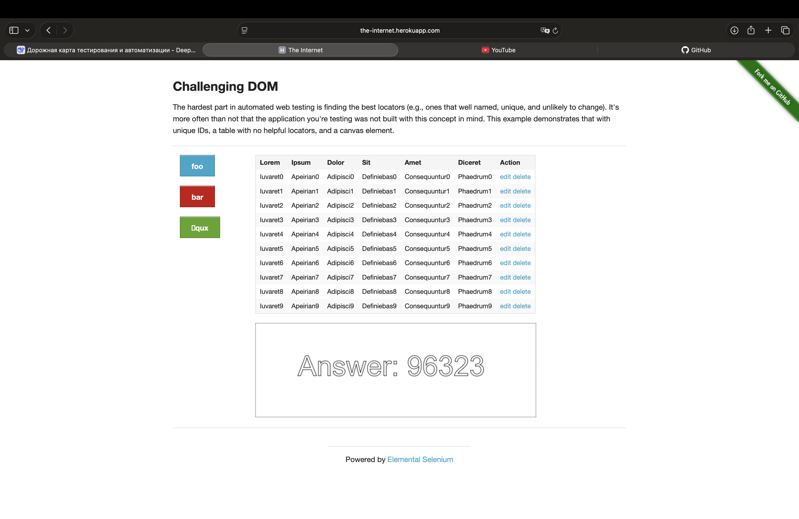

# Bug Report: Кнопки edit и delete не выполняют заявленных действий

**ID:** BUG-001
**Severity:** High
**Priority:** Medium

**Environment:**
- Device: MacBook Air M4
- OS: macOS Sequoia
- Browser: Safari
- URL: https://the-internet.herokuapp.com/challenging_dom

**Steps to Reproduce:**
1. Открыть страницу Challenging DOM.
2. Нажать кнопку "edit" в любой строке таблицы.
3. Нажать кнопку "delete" в любой строке таблицы.

**Actual Result:**
При нажатии  кнопки "edit" строка таблицы не открывается на редактирование.
При нажатии кнопки "delete" запись не удаляется.

**Expected Result:**
Кнопка "edit" должна открывать форму редактирования записи (или показывать, что запись изменена).
Кнопка "delete" должна удалять запись из таблицы (или показывать диалог подтверждения).

**Screenshot:**
