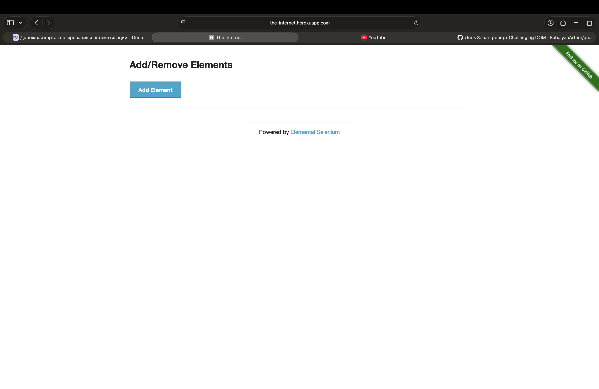

# Test Case: Добавление и удаление элементов

**ID:** TC-001
**Status:** ✅ Passed

**Environment:**
- Device: MacBook Air M4
- OS: macOS Sequoia
- Browser: Safari
- URL: https://the-internet.herokuapp.com/add_remove_elements

**Steps:**
1. Открыть страницу Add/Remove Elements.
2. Нажать кнопку "Add Element" 5 раз.
3. Нажать кнопку "Delete" 5 раз.

**Expected Result:**
После добавления появляются 5 элементов. После удаления элементы исчезают.

**Actual Result:**
Элементы добавились и удалились корректно. Баг не обнаружен.

**Screenshot:**
